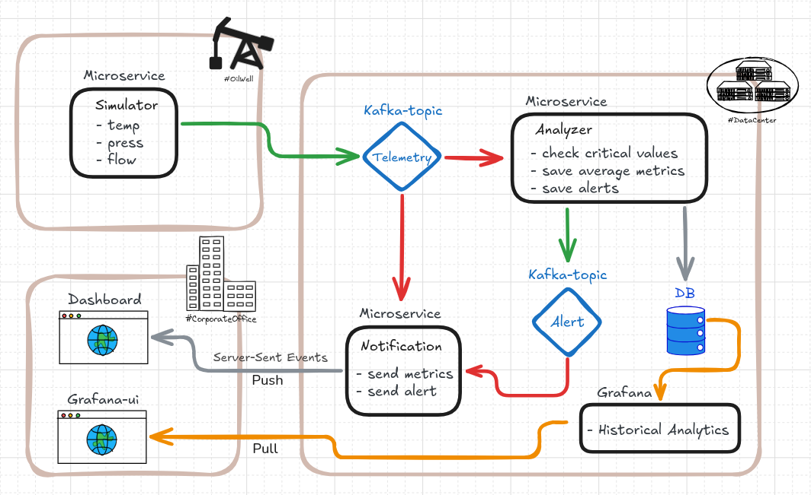

# WellStream: Upstream Telemetry Streaming 🛢️

**WellStream** es un motor de ingesta de datos basado en eventos diseñado específicamente para el monitoreo en tiempo real en la industria _Upstream_ (exploración y producción petrolera).

Este proyecto implementa una **Arquitectura Orientada a Eventos (EDA)** utilizando **Spring Boot** y **Apache Kafka** para simular, transmitir y procesar telemetría crítica de un pozo. El sistema genera datos orgánicos de presión, temperatura y caudal de forma random, y utiliza el patrón Productor-Consumidor para manejar flujos continuos de información, simulando el posible comportamiento real de los sensores IoT en los yacimientos.

## 🏗️ Arquitectura del Sistema

El sistema está diseñado bajo una arquitectura de microservicios orientada a eventos (EDA - Event-Driven Architecture). Aplica el principio de **Separation of Concerns** bifurcando el flujo de datos para atender dos necesidades de negocio distintas:

- **Hot Path (Línea Caliente - Tiempo Real):** Orientada al monitoreo de alertas y reacción inmediata. El `msvc-analyzer` evalúa la telemetría entrante y, si detecta una anomalía, emite instantáneamente un evento de alerta de vuelta a Kafka. El `msvc-notification` consume estos eventos y los empuja al navegador del Operador mediante **Server-Sent Events (SSE)**. Latencia de milisegundos, ideal para toma de acciones críticas.
- **Warm/Cold Path (Línea Histórica - Analítica):** Orientada al análisis histórico y visualización de tendencias. En paralelo al Hot Path, el `msvc-analyzer` deriva el cálculo de promedios a hilos asíncronos (`@Async`). Este proceso acumula lecturas y persiste el historial en una base de datos relacional sin bloquear la lectura de Kafka. Esta data es consumida por **Grafana** (mediante Polling SQL) para el análisis de tendencias a largo plazo.

## ⚙️ Microservicios

El monorepo está compuesto por los siguientes módulos:

- **`msvc-simulator` (Producer):** Actúa como el origen de los datos IoT. Genera lecturas orgánicas de presión, temperatura y caudal de los pozos, serializa los objetos usando **Protobuf** y los publica en Apache Kafka a alta velocidad.
- **`msvc-analyzer` (Stream Processor & DB Writer):** El corazón analítico del sistema. Funciona como un enrutador inteligente que bifurca la información: ejecuta las reglas de negocio críticas para generar alertas inmediatas (Hot Path) y delega el cálculo de promedios a procesos asíncronos para guardarlos en la base de datos (Cold Path).
- **`msvc-notification` (Real-Time Pusher):** Un servicio ultraligero y sin estado (stateless). Consume los tópicos de alertas y telemetría de Kafka para empujar notificaciones directamente al dashboard del Operador vía **SSE**.

## 🚀 Decisiones Técnicas Destacadas (Highlights)

- **Serialización Binaria con Protobuf:** Se reemplazó JSON por Protocol Buffers de Google para la serialización de mensajes en Kafka. Esto redujo drásticamente el peso de los mensajes y aumentó la velocidad de transmisión en la red, emulando entornos industriales reales de alto rendimiento.
- **Idempotencia y Manejo de Concurrencia:** Se implementó un manejo de condiciones de carrera (Race Conditions) a nivel de base de datos durante la resolución de alertas. Múltiples hilos concurrentes pueden intentar resolver una alerta simultáneamente sin generar inconsistencias ni lanzar excepciones no controladas.
- **Push vs Pull:** Uso de conexiones persistentes unidireccionales (SSE) para el tablero operativo en lugar del clásico _polling_ HTTP.
- **Procesamiento Asíncrono:** Aislamiento de tareas de cómputo (como promedios matemáticos) en hilos separados usando `@Async` para no bloquear los listeners de Kafka (ConsumerSeekAware) garantizando la lectura continua del tópico.

## 🛠️ Stack Tecnológico

- **Backend:** Java 17+, Spring Boot, Spring Data JPA, Spring Kafka.
- **Mensajería & Serialización:** Apache Kafka, Protocol Buffers (Protobuf).
- **Base de Datos:** PostgreSQL / MySQL.
- **Observabilidad & Dashboards:** Grafana, Server-Sent Events (Vanilla JS/React frontend).
- **Infraestructura:** Docker, Docker Compose, Maven (Estructura Multi-módulo).

## 👥 Casos de Uso (Roles)

El sistema atiende a dos perfiles de usuarios dentro de la compañía petrolera:

1. **Operador de Planta (SSE Dashboard):** Necesita latencia cero. Visualiza parpadeos en rojo en el segundo exacto que se detecta anomalías y puede tomar acciones inmediatas (ej. apagar un pozo de emergencia).
2. **Ingeniero de Datos / Gerencia (Grafana):** Necesita contexto. Visualiza gráficos de tendencias históricas semanales o mensuales para la toma de decisiones estratégicas.

## 🔮 Trabajo Futuro (Roadmap)

- Integración de un **API Gateway** con **Keycloak** para validación de tokens JWT (seguridad y control de accesos basados en roles).
- Tópicos de `commands` en Kafka para ejecutar acciones bidireccionales en los pozos desde el frontend.

## 💻 Cómo ejecutar el proyecto

_(Aquí deberías agregar los comandos básicos)_

1. Levantar infraestructura base: `docker-compose up` (Kafka-Postgres, Grafana).
2. Compilar los contratos Protobuf: `mvn clean install`
3. Iniciar los microservicios
4. Iniciar el dashboard-web
5. Consumir: dashboard :5173 - grafanaUi :3009 - kafkaui :3010
